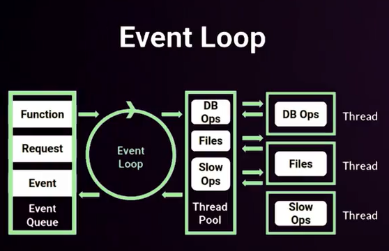

# NODE
Entorno de ejecución orientado a servidores, no funciona con navegador
## Caracteristicas
* Concurrencia: Monohilo con entradas y salidas asíncronas.
* Motor V8: Creado por google, este convierte el js a código máquina de manera rapida.
* Módulos: Todo lo que no sea sintaxis de programación, son módulos.
* Orientado a eventos: Existe un bucle de eventos que se ejecuta constantemente. Esto permite que el código se comporte de forma reactiva ante cualquier evento.
### EventLoop
Es un proceso con un bucle que gestiona, de forma asíncrona, todos los eventos de la aplicación.
AL ser monohilo, si ocurre lgún error, esto parará todo el proceso. Es necesario hacer uso de manejo de errores para no parar el proceso.

